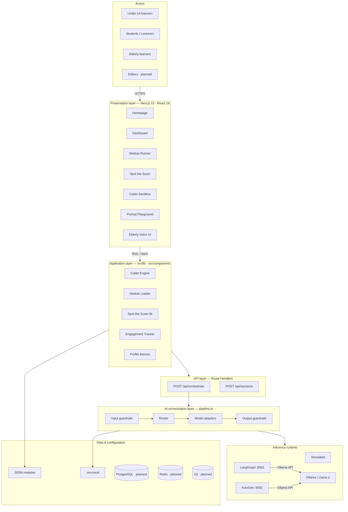
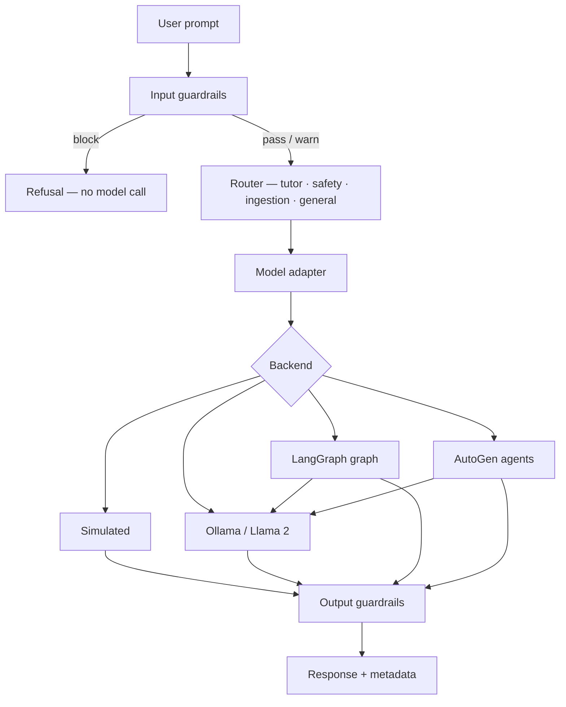

# academAI — Technical Overview

**Tagline:** Learn · Practice · Prevent

---

## Architecture diagram (draw.io style)

Layered technical architecture with swimlanes — solid boxes are shipped, dashed are planned.

**Interactive SVG version:** open [academai-architecture.canvas.tsx](canvases/academai-architecture.canvas.tsx) in Cursor → Architecture view.

---

## Orchestration flow diagram

**Guardrails (always on):**

| Stage | Checks |
|-------|--------|
| Input | EU AI Act, safety blocks, PII / academic integrity warnings |
| Output | Length cap, phone/email redaction, AI-generated disclosure label |

---

## Technical pitch

### Problem

Most people meet AI through chat tools that optimize for *usage*, not *literacy*. Learners rarely practice spotting scams, deepfakes, or biased outputs — and rarely prompt with guardrails in mind.

### Solution

**academAI** is an AI literacy platform for schools, universities, and community programs. It serves three audiences (under-14, students/lecturers, elderly) through one stack:

| Pillar | What it does |
|--------|----------------|
| **Learn** | Short JSON-driven modules — deepfakes, bias, AI basics — in plain language |
| **Practice** | Spot the Scam — scenario-based judgment training |
| **Prevent** | Cadet Sandbox — live prompting through a guardrailed orchestrator (Llama 2 local) |

### Why the architecture matters

1. **Guardrails before generation** — every prompt hits Cadet rules server-side; blocked requests never reach a model.
2. **Pluggable orchestration** — one API (`POST /api/orchestrate`) swaps simulated, Ollama, LangGraph, and AutoGen without UI changes.
3. **Local-first privacy** — Llama 2 via Ollama keeps inference on-network; ideal for GDPR-conscious classrooms.
4. **Explainable by design** — routing, backend, and disclosure travel with every response for teaching moments.

### Stack (shipped)

| Layer | Technology |
|-------|------------|
| Frontend | Next.js 15, React 19, TypeScript, CSS Modules |
| Learning | Cadet engine, JSON content, Spot the Scam bank |
| API | Next.js Route Handlers |
| Orchestration | `pipeline.ts` — guardrails → router → adapters |
| Inference | Ollama (Llama 2), Python sidecars (LangGraph, AutoGen) |

### Elevator pitch (60 seconds)

> academAI teaches AI literacy the way people actually need it — not just how to chat, but how to *think*. Learners follow Learn · Practice · Prevent: modules explain concepts simply, Spot the Scam trains real-world judgment, and Cadet Sandbox lets students prompt a real model behind guardrails. Everything routes through one orchestration API that can run locally on Llama 2 or scale to LangGraph ingestion pipelines and AutoGen tutor agents. Prompts are scanned for safety and EU AI Act issues before any model runs; outputs are redacted and labeled. Built on Next.js, designed for three audiences from children to the elderly, and ready to grow into editor-reviewed content ingestion and personalized recommendations — without sacrificing explainability or privacy.

### Roadmap

| Phase | Capability | Status |
|-------|------------|--------|
| Now | Modules, Spot the Scam, Cadet Sandbox, Ollama orchestrator | Shipped |
| Now | LangGraph + AutoGen sidecars | Running |
| Next | Engagement persistence, ML profile recommendations | Designed |
| Next | RSS ingestion + editor review queue | Designed |
| Later | Auth, PostgreSQL, LMS export | Planned |

---

*Interactive version with SVG diagrams: open `canvases/academai-architecture.canvas.tsx` in Cursor.*
