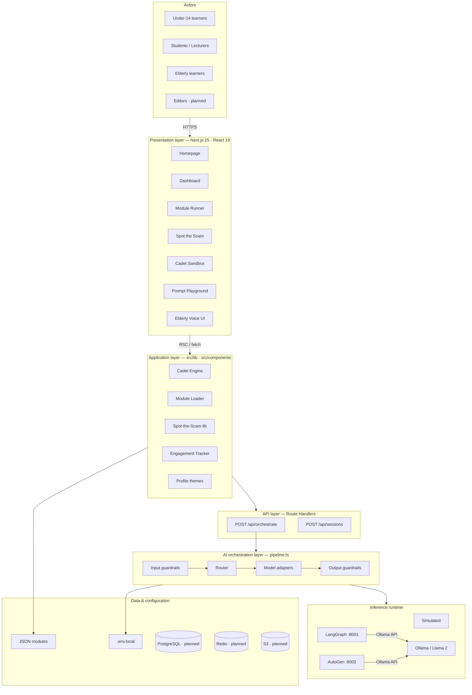
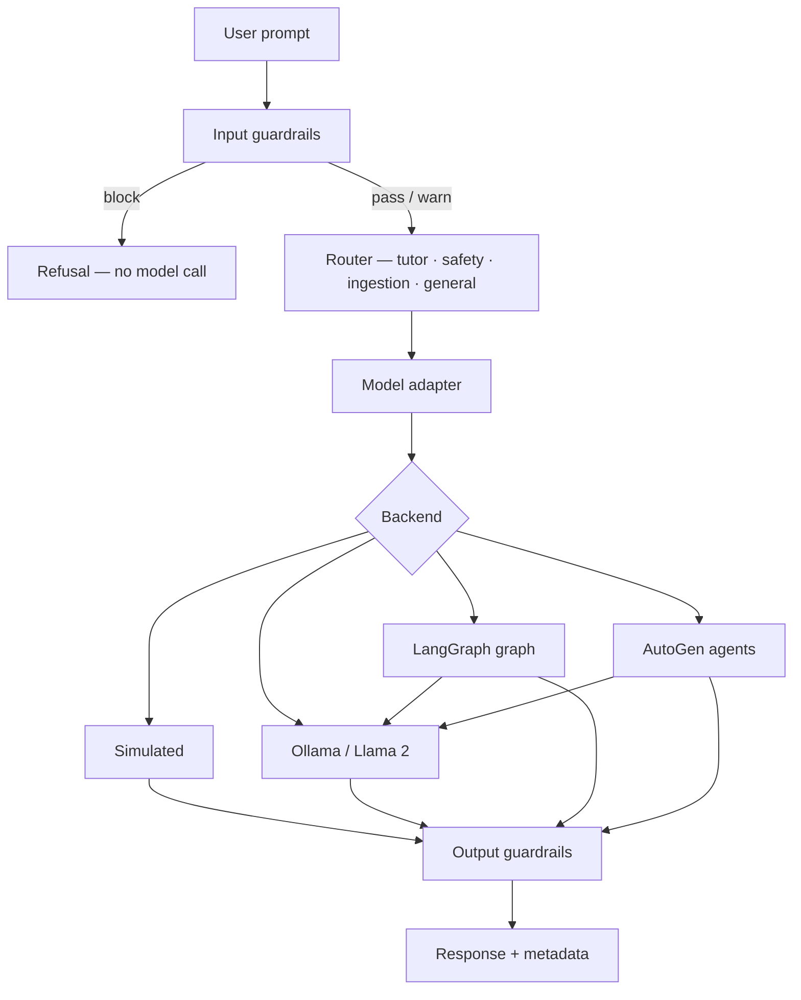

# academAI — Technical Overview (Downloadable)

**Tagline:** Learn · Practice · Prevent

> Full technical overview with Mermaid diagrams. For vector diagrams, use the SVG or draw.io files in this folder.

---

## Architecture diagram (draw.io style)

Layered technical architecture with swimlanes — solid boxes are shipped, dashed are planned.

**Vector export:** `academai-technical-architecture.svg` or `academai-technical-architecture.drawio`

---

## Orchestration flow diagram

**Vector export:** `academai-orchestration-flow.svg`

**Guardrails (always on):**

| Stage | Checks |
|-------|--------|
| Input | EU AI Act, safety blocks, PII / academic integrity warnings |
| Output | Length cap, phone/email redaction, AI-generated disclosure label |

---

## Technical pitch

See `academai-technical-pitch.md` for the full investor/stakeholder pitch document.

---

*Generated for academAI · docs/exports/*
